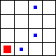

# Learning The World's Hardest Game

My attempt to use deep reinforcement learning with TensorFlow to teach a computer how to play The World's Hardest Game for 6.867 Machine Learning at MIT. It didn't go so well, but I got some cool results on a few toy games I created along the way.

## Abstract

[The World's Hardest Game](http://www.worldshardestgame.org/) is a Flash game made popular online in 2007. It features a simple square player, whose goal is to navigate a series of levels by traveling from a designated start area to a designated finish area, avoiding deterministically-moving enemies and collecting all coins on the map. While the game results in a rather frustrating experience for most human players, I propose teaching a computer to play (and master) the game, using [Deep Q-learning with Experience Replay](https://www.cs.toronto.edu/~vmnih/docs/dqn.pdf).

## Proposal

The proposal for this project can be found [here](tex/proposal/proposal.pdf).

## Paper

The final paper for this project can be found [here](tex/report/report.pdf).

## Toy Games

In addition to TWHG, described above, I implemented several simple games of varying difficulty, in order to test the efficacy of the techniques and models presented in the paper within a limited span of time.

### TG1D

The first game (TG1D) is a very simple game, involving a 1-dimensional 4-square grid that has one enemy randomly placed on one of the middle two squares. The enemy appears and disappears with a random phase, and the goal of the player is to move from the first square to the last, without ever being in the same square as the in-phase enemy. The possible moves for the player are {`left`, `right`, `stay`}.

### TG2D

TG2D is the natural 2-dimensional progression of this simple game. The game is played on a 4 × 4 grid, with the starting location for the player at (0, 0) and the goal location at (3, 3). A single enemy occupies a random square selected from those that are not the start or goal, with a random phase. The objective is the same. The possible moves for the player are {`left`, `right`, `down`, `up`, `stay`}.

### TG2D-H

TG2D-H is the exact same game as TG2D, but with multiple enemies. Each enemy is sampled from the squares remaining after removing the start, goal, and any square that currently has an enemy assigned to it.

## Baselines

### Random

I implemented a basic random model as a baseline. The model samples an action from a uniform distribution over 𝒜.

|  Game  | Win Rate (%) |
|:------:|:------------:|
|  TG1D  |     28.85    |
|  TG2D  |     36.95    |
| TG2D-H |     9.18     |

### ϵ-Greedy

Our next baseline was a ϵ-greedy model that sampled a uniformly random action with probability ϵ, and took the greedy action at *t* + 1 based on the rewards at *t* with probability 1 − ϵ. For the below values, I used ϵ = 0.05.

|  Game  | Win Rate (%) |
|:------:|:------------:|
|  TG1D  |     92.06    |
|  TG2D  |     77.76    |
| TG2D-H |     47.98    |

## Results

I ran the best model over several training runs for each game, and present the results below. For any game more complex than the basic 1-D toy game, our Deep Q-learning model outperforms the naive ϵ-greedy model.

For the simple TG1D, I hypothesize that such a simple game can effectively be mastered with a greedy strategy, and that our function approximator could not match these results given the limited training time.

|  Game  | Win Rate (%) | \# Training Frames |
|:------:|:------------:|:------------------:|
|  TG1D  |     71.28    |        800k        |
|  TG2D  |     88.91    |        900k        |
| TG2D-H |     54.81    |        1.5M        |
